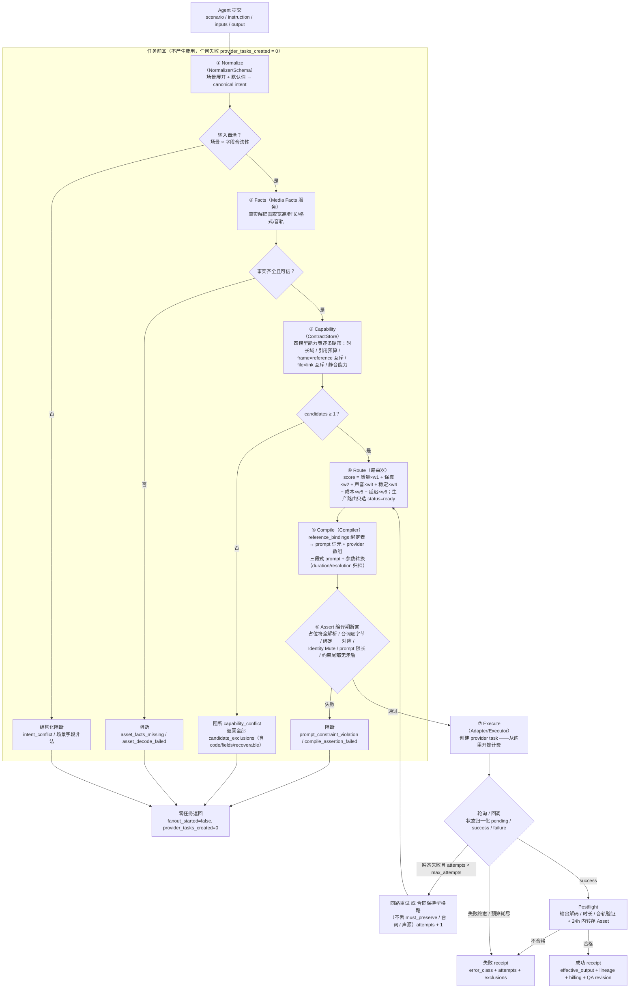
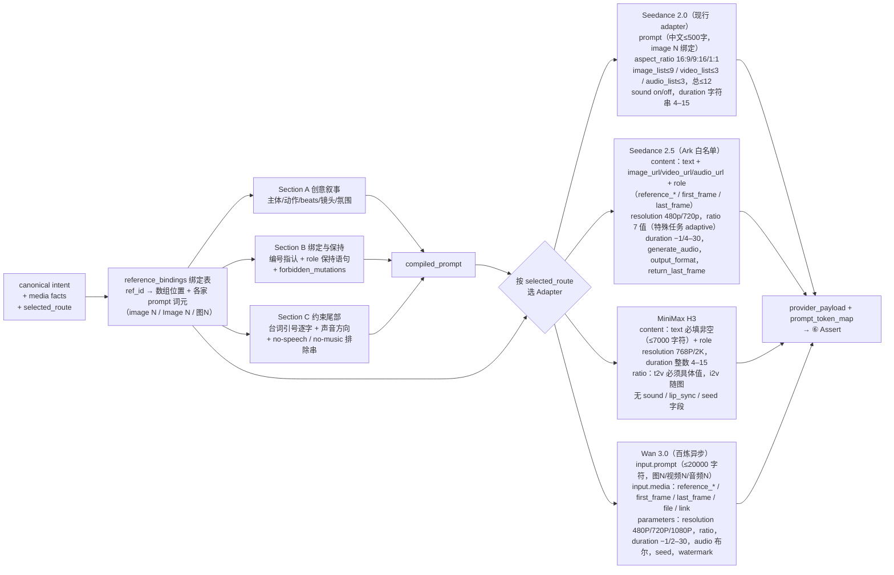

# 视频生成工具编译设计：Seedance 2.0/2.5 × MiniMax H3 × Wan 3.0

**日期：2026-08-10**
**性质：**编译层（intent → provider payload）设计稿，供产品与研发评审；不修改现有 runtime 与 `tech-*`。
**上游文档：**
- 《视频生成工具统一业务字段与模型路由需求 v2》（Agent 四字段：`scenario / instruction / inputs / output`）
- 《视频生成工具封装需求｜产品与研发评审版 v1.0》（canonical intent、speech 语义、receipt）
- 《Seedance 2.5 API 与 Pexo 字段封装手册》`docs/seedance-2.5-api-field-guide.md`
- 《H3 接入预审补充：字段映射与模型路由》`analysis/video-generation-h3-api-routing-pre-review-v1.md`
- 《Wan 3.0 API 接口速览》（wan3_api_quickstart，核验 2026-08-10）
- generation-skill：`video-models-routing.md`、`video-generation-execution.md`（Strategy Genes / 音频合同 / Subject Binding）

## 0. 一句话

编译 = 把 Agent 的场景化意图（scenario + instruction + inputs + output），经 **Normalize → Facts → Capability → Route → Compile → Assert → Execute** 七步，机械转换成四个 provider 各自的合法 payload；每一步只消费上一步的结构化产物，任何硬冲突在创建 provider task 之前返回结构化阻断（`provider_tasks_created=0`）。

```text
Agent: scenario / instruction / inputs / output
  ① Normalize   场景展开 → canonical intent（scene/speech/creative/references/output/execution）
  ② Facts       每个 asset_id 取权威媒体事实（解码器，非文件名/VLM）
  ③ Capability  四模型能力表逐条筛选 → candidates + candidate_exclusions
  ④ Route       硬排除后按 质量×保真×声音×稳定 − 成本 − 延迟 排序
  ⑤ Compile     reference_bindings → 三段式 prompt + provider 参数（同一份绑定表生成两者）
  ⑥ Assert      编译期断言（占位符、台词逐字、绑定一一对应、prompt 限长、约束尾部）
  ⑦ Execute     创建任务 → 状态归一化 → 产物即时转存 → receipt
```

### 0.1 主流程图



### 0.2 编译分支图（⑤ 内部 → 四个 Adapter）



## 1. 范围与模型状态

| 模型 | 入口 | 状态 | 生产路由 |
|---|---|---|---|
| Seedance 2.0 / 2.0 Fast | 现行 adapter `seedance_reference2video`（保持不动） | `ready` | 是（现行主力） |
| Seedance 2.5 | Ark `POST /api/v3/contents/generations/tasks`，`doubao-seedance-2-5-260628` | `gated`（runtime P0 + 在线 T1–T5 通过后开） | 灰度 |
| MiniMax H3 | `POST /v2/video_generation`，`MiniMax-H3` | `planned`（Adapter 未接通） | 否，仅 shadow |
| Wan 3.0 | 百炼异步 `video-synthesis`，`wan3.0-video` | `invite_pending`（邀测权限 + 地域三件套） | 否，仅评测 |

规则：**生产路由只允许 `ready`**；`gated/planned/invite_pending` 模型出现在 candidates 时必须带 `model_not_in_production` 排除码，可用于 shadow 对比，不可创建付费任务（评测通道除外）。Kling 与 HappyHorse 保持 `video-models-routing.md` 现行合同，不在本文重复。

## 2. Agent 字段 → canonical intent（Normalize）

沿用统一封装 v2 的四字段入口。Normalizer 按 `scenario` 展开成内部 canonical intent，并做两份文档的词表合并裁定：

- **`speech.mode` 用评审版四值（场景语义）**：`on_camera_sync_speech / voiceover_safe_broll / nat_sound_only / silent`；
- **v2 的 `generated | provided | silent | preserve_source` 降为 `speech.driver.kind`（来源语义）**：`co_generated / audio_asset / existing_video_audio / none`；
- `audio_asset` 细分角色沿用 generation-skill：`speech_driver`（= `audio_list_speech`，精确口播时钟）、`voice_identity`（= `audio_list_voice_ref`，只取音色，台词在 prompt 引号里）、`music`（= `audio_list_music`）。

```yaml
intent:
  scene:
    type: talking_head | broll | product_demo | first_last | edit_existing | continuation | doc_driven | ...
    subjects: [{ref_id, role, visibility, provenance, preservation}]
  speech:
    mode: on_camera_sync_speech | voiceover_safe_broll | nat_sound_only | silent
    driver: {kind: co_generated | audio_asset | existing_video_audio | none,
             ref_id, audio_role: speech_driver | voice_identity | music}
    speaker_ref_id:            # on_camera_sync_speech 必填，指向 on_camera 主体
  creative:
    description:               # 只写画面/动作/镜头/氛围
    beats: []                  # 单生成单元内部节拍
    exact_dialogue: [{line_id, speaker_ref_id, text}]   # 唯一台词事实源，逐字
  references:
    - {asset_id, ref_id,
       role: character | product | style | environment | first_frame | last_frame |
             video_reference | edit_source | continuation_source |
             audio_speech_driver | audio_voice_reference | audio_music |
             doc_source | link_source,
       preservation: must_preserve | may_transform | style_only,
       forbidden_mutations: []}
output:                        # provider-neutral OutputSpec（沿 2.5 runtime 需求 §5.2）
  aspect_ratio: 16:9 | 9:16 | 1:1 | 4:3 | 3:4 | 21:9 | adaptive
  final_timeline_duration_ms:  # 业务时间线需要，不直接进 provider
  source_duration_seconds:     # 编译产物：合法源片时长（可 -1）
  resolution: auto | 480p | 720p | 1080p | 2k
  container: mp4 | mov
  return_last_frame: false
execution:
  max_attempts: 3
  degradation_policy: {mode: strict | controlled, allowed_capability_losses: []}
  idempotency_key:
```

### 2.1 generation-skill 字段的传递（skills → 工具）

skill 的 `sequence_manifest` / `audio_content` 不再手工携带路由结果，按下表灌入 canonical intent；`route_provider / route_model` 改为路由输出，只出现在 receipt：

| generation-skill 字段 | canonical 去向 |
|---|---|
| `final_timeline_duration_ms` | `output.final_timeline_duration_ms` |
| `source_generation_duration_s` | 废弃手填 → 由时长编译器产出 `output.source_duration_seconds` |
| `sound_mode` + `video_native_audio_policy` | `speech.mode` + 装配策略（`mute_for_independent_audio` 等只影响 postflight/装配与 prompt 约束尾部） |
| `post_bgm_planned=true` | 编译器自动加 no-music 约束尾部并去重 |
| `sfx_event_plan` | `keep_nat_sound` 的前置证据；进 receipt，不进 provider 字段 |
| `audio_content.speech[].planned_source` | `speech.driver.kind/audio_role`（`co_gen_dialogue→co_generated`、`audio_list_speech→audio_asset/speech_driver`、`audio_list_voice_ref→audio_asset/voice_identity`、`post_vo→none`） |
| `exact_text` | `creative.exact_dialogue[].text` |
| `required_refs` / subject manifest | `references[]`，`preservation=must_preserve` |
| `expected_audio_lineage` | receipt.lineage |

Strategy Genes 中 `routing.*`、`prompt.material_binding_required`、`audio.voice_source_exclusive` 等校验从"skill 文本要求 Agent 遵守"下沉为编译器/validator 的机器断言（对应 §7、§8）。

### 2.2 接口形态与长尾策略：preset / custom_intent / intent_draft

接口形态三选一的谱系：**纯字段（现状 provider_param，已被生产数据证伪）→ 场景化少字段（v2 裁定，主路径）→ 纯 query 后台解析（错误转移 + 不可审计，只做草稿辅助）**。裁定为三层入口，汇入同一个 canonical intent 和同一条七步流水线：

| 层 | 入口 | 覆盖 | 说明 |
|---|---|---|---|
| 1 | `scenario` preset（15 个枚举） | 高频场景 | 字段少、默认值强、组合空间被场景锁死 |
| 2 | `scenario: custom_intent` | 长尾场景 | `inputs` 直接使用 canonical 通用形态（`scene.type + speech{} + references[](role/preservation) + exact_dialogue`），校验/Facts/路由/编译与 preset 完全同路，只是无默认值、必填更多、澄清概率更高 |
| 3 | `intent_draft(query, asset_ids)` | 自然语言起草 | 只读、免费；输出结构化意图草稿 + 缺口清单，Agent 确认补全后仍以结构化形态提交。解析错误在付费前对 Agent 可见 |

三条设计原则：

1. **scenario 枚举收敛的是"字段组合合法性"，不是"能做什么"**——长尾不需要新接口，只是不走快捷方式；preset 列表由 observability 统计 `custom_intent` 高频形态后持续发布，是运营出来的，不是一次设计完的。
2. **Agent 填字段一定出错，设计目标是"错得便宜"**——字段只声明意图不声明事实（事实由 Facts 服务解码得出）、严格 decode 拒绝未知字段、错误带 `suggested_repair` 一轮可修。字段是给校验器看的，不是给模型看的：暴露字段的价值 = 能在花钱前被确定性拦截的错误比例。
3. **纯 query 不能做主接口**——它把"Agent 填错"变成"后台猜错"，`exact_dialogue` 逐字保真、素材角色、`must_preserve` 无法从自由文本可靠恢复，且同一 query 两次解析可能不同，破坏 canonical hash 与幂等。`intent_draft` 的定位与 H3-Context-IR 相同：可以增强，不能替代 preflight，不能覆盖台词与保真合同。

## 3. 四模型能力注册表（Capability）

同一 ContractStore 供 Plan、Preflight、Route、Compiler、Adapter 消费；数字以本地接口手册为准：

```yaml
seedance-2.0:            # 现行 adapter 合同
  modes: [text_to_video, reference_to_video, continuation(video_list)]
  ratios: [16:9, 9:16, 1:1]            # 必填
  duration: "4".."15"                   # 字符串，源片时长
  references: {images: 9, videos: 3, audios: 3, total: 12}
  video_each: 2..15s, video_total: 15s
  audio_each: 2..15s, audio_sole_input: false     # 音频不能唯一输入
  sound: on | off                       # 输出开关；audio_list 是输入参考，两者无关
  prompt: 中文 ≤500 字，"image 1 / video 2 / audio 1" 位置绑定
  first_last_frame: prompt 模拟（非原生，不承诺）
  edit_video: false

seedance-2.5:            # Ark 白名单
  model_id: doubao-seedance-2-5-260628
  modes: [text_to_video, reference_to_video, edit_video, extend_video,
          first_frame_to_video, first_last_frame_to_video]
  resolutions: [480p, 720p]             # 无 1080p，文档不得宣称
  ratios: [21:9, 16:9, 4:3, 1:1, 3:4, 9:16, adaptive]
  duration: -1 | 4..30                  # edit 强制 -1；edit/extend/frame 任务 ratio 强制 adaptive
  references: {images: 30, videos: 10, audios: 10}
  image: 300..6000px, ar 0.4..2.5, ≤30MB
  video: mp4/mov, each 2..30s, ≤200MB, total ≤30s
  audio: wav/mp3, each 2..30s, ≤15MB, total ≤30s, audio_only_reference: true
  generate_audio: bool(默认 true, 单声道)
  output_format: mp4 | mov;  return_last_frame: bool
  frame_vs_reference: 互斥；last_frame 必须伴随 first_frame
  server_fields: callback_url, priority 0-9, execution_expires_after 3600..259200,
                 safety_identifier(≤64), tools[web_search], watermark
  forbidden: seed, camera_fixed, frames, draft, service_tier=flex
  prompt: 中文 ≤500 字 / 英文 ≤1000 词；对话用双引号

minimax-h3:
  endpoint: POST /v2/video_generation, model: MiniMax-H3
  modes: [text_to_video, first_last_frame_i2v, reference_to_video, edit_video]
  resolutions: [768P, 2K]
  ratios: [21:9, 16:9, 4:3, 1:1, 3:4, 9:16, adaptive]
  ratio_rules: t2v 必须具体比例（禁 adaptive）；i2v 比例随输入图，请求值可能被忽略
  duration: int 4..15（2-3 秒必须生成后剪辑）
  references: {images: 9, videos: 3, audios: 3, total: 12}
  video_each: 2..15s, video_total 15s；audio_each 2..15s, audio_total 15s
  file_size: {image: 30MB, video: 50MB, audio: 15MB, request: 64MB}
  prompt: ≤7000 字符，text 永远必填非空
  frame_vs_reference: 互斥
  missing: sound 开关、lip_sync、seed、negative_prompt、幂等键
  flags: strict_lip_sync: experimental; native_silent_output: unsupported;
         generalized_editing: input_supported; strict_source_timeline: experimental;
         original_audio_preservation: unsupported; exact_2_3s: unsupported
  extras: /v2/h3_context_ir（仅 prompt 增强）；running 不可取消；回调 3s challenge
  price: 768P $0.08/s, 2K $0.13/s，前 5 图免费

wan-3.0:
  endpoint: 百炼异步 video-synthesis（X-DashScope-Async: enable），模型/Endpoint/Key 须同地域
  model_id: wan3.0-video（邀测）
  modes: [text_to_video, first_last_frame, reference_to_video, edit_video,
          doc_to_video, url_to_video]
  resolutions: [480P, 720P, 1080P]（默认 1080P）
  ratios: [adaptive, 16:9, 4:3, 1:1, 3:4, 9:16]（默认 adaptive）
  duration: int 2..30 | -1 智能时长；带参考视频时 输入视频总时长+输出 ≤30s
  media: first_frame ≤1; last_frame ≤1; reference_image ≤10(≤20MB);
         reference_video ≤5(单段1..15s, 总≤15s, ≤100MB, mp4/mov);
         reference_audio ≤5(单段1..15s, 总≤15s, ≤15MB, wav/mp3);
         file ≤1(≤100MB/50页, Office/PDF/TXT/MD/iWork); link ≤1(公开网页)
  exclusions: 首尾帧组 × 全能参考组 互斥；file × link 互斥
  edit: 唯一 reference_video 作为 edit_source；无 mask/source-timeline/原音保持字段
  parameters: audio bool(默认 true, 开关同价), seed 0..2147483647, watermark
  prompt: ≤20000 字符，超出会被 Provider 自动截断；Pexo 编译器必须主动拒绝；"图1 / 视频1 / 音频1" 分类型独立计数
  lifecycle: PENDING→RUNNING→SUCCEEDED/FAILED/CANCELED，另有 UNKNOWN；建议 15s 轮询，查询 RPS 20；
             task_id 与 video_url 仅保留 24h，必须即时转存
  price: 480P ¥0.3/s, 720P ¥0.6/s, 1080P ¥1.2/s
```

## 4. 任务类型判定与支持矩阵

任务类型由 **canonical intent + reference roles 显式决定**，禁止从 prompt 关键词反推（2.5 runtime 需求 Non-goal 4）：

| task_type | 判定依据 | S2.0 | S2.5 | H3 | Wan3.0 |
|---|---|---|---|---|---|
| `text_to_video` | 无引用素材 | ✅ | ✅ | ✅（ratio 必须具体值） | ✅ |
| `reference_to_video` | 有 `reference_*` 角色 | ✅ | ✅ | ✅ | ✅ |
| `first_frame_to_video` | `first_frame` | prompt 模拟，不承诺 | ✅（ratio=adaptive） | ✅ | ✅ |
| `first_last_frame_to_video` | `first_frame`+`last_frame` | ✖ 排除 | ✅（adaptive） | ✅ | ✅ |
| `edit_video` | `edit_source` + edit intent | ✖ | ✅（ratio=adaptive，duration=-1） | ✅ 独立 `editvideo` route（严格保持待测） | ✅ 独立 `editvideo` route（严格保持待测） |
| `extend_video` / 续写 | `continuation_source` | ✅ `video_list`+`sound:on` 可保音频 | ✅ | ✖ 未验证 | ⚠️ 未验证 |
| `audio_only_reference` | 只有音频引用 | ✖（需视觉伴随） | ✅（2.5 独有已核验） | ⚠️ 未验证 | ⚠️ 未验证 |
| `doc_to_video` / `url_to_video` | `doc_source` / `link_source` | ✖ | ✖ | ✖ | ✅ 独有 |

三家新模型（S2.5 / H3 / Wan）**首尾帧模式与参考模式全部互斥**，这条可以做成跨 provider 的统一预检：`frame_reference_conflict`。

## 5. 字段映射总表（canonical → 四 provider）

去向标记沿评审版 v1.0 §6.5：`直传` / `prompt` / `引用编译` / `路由` / `回执`。

| Canonical 字段 | Seedance 2.0（adapter） | Seedance 2.5（Ark） | MiniMax H3 | Wan 3.0 | 去向 |
|---|---|---|---|---|---|
| `creative.description`(+beats) | `prompt` | `content[text].text` | `content[text].text`（必填非空） | `input.prompt` | prompt |
| `creative.exact_dialogue[].text` | prompt 引号逐字 | prompt 双引号逐字 | prompt 引号逐字（软约束） | prompt 引号逐字（软约束） | prompt |
| `references[role=character/product/style/environment]` | `image_list[]` + "image N" | `content[image_url, role=reference_image]` | `content[image_url, role=reference_image]` | `media[type=reference_image]` + "图N" | 引用编译 |
| `references[role=video_reference]` | `video_list[]` + "video N" | `role=reference_video` | `role=reference_video` | `media[type=reference_video]` + "视频N" | 引用编译 |
| `references[role=audio_speech_driver/voice_reference/music]` | `audio_list[]` + "audio N"（prompt 必须声明角色） | `role=reference_audio` | `role=reference_audio` | `media[type=reference_audio]` + "音频N" | 引用编译 |
| `references[role=first_frame/last_frame]` | ✖（排除或 prompt 模拟） | `role=first_frame/last_frame` | `role=first_frame/last_frame` | `media[type=first_frame/last_frame]` | 引用编译 |
| `references[role=edit_source]` | ✖ | `role=reference_video` + edit intent | ✖ 排除 | ✖ 排除 | 引用编译/路由 |
| `references[role=doc_source/link_source]` | ✖ | ✖ | ✖ | `media[type=file/link]` | 引用编译 |
| `speech.mode` + driver | `sound` + `audio_list` 组合 | `generate_audio` + `reference_audio` 组合 | 无字段：路由 + prompt | `parameters.audio` + `reference_audio` | 路由 |
| `output.aspect_ratio` | `aspect_ratio`（16:9/9:16/1:1） | `ratio`（特殊任务强制 adaptive） | `ratio`（t2v 禁 adaptive；i2v 随图） | `parameters.ratio` | 直传 |
| `output.source_duration_seconds` | `duration` 字符串 "4"–"15" | `duration` int −1/4–30 | `duration` int 4–15 | `parameters.duration` int −1/2–30 | 直传（需转换） |
| `output.resolution` | ✖ 无字段 | `resolution` 480p/720p | `resolution` 768P/2K | `parameters.resolution` 480P/720P/1080P | 直传 |
| `output.container` | ✖（默认 mp4） | `output_format` mp4/mov | ✖ | ✖ | 直传 |
| `output.return_last_frame` | ✖ | `return_last_frame` | ✖ | ✖ | 直传 |
| `execution.idempotency_key` | 平台 replay key | 同左（无原生幂等） | 同左（无原生幂等） | 同左（无原生幂等） | 回执 |
| `execution.max_attempts` / degradation | 平台执行层 | 同左 | 同左（每次重试新 task 新费用） | 同左 | 回执 |
| —（服务端专属） | — | `callback_url/priority/expires/safety_identifier/tools/watermark` | `callback_url` | `seed/watermark` | Execution 层持有，Agent 不可见 |

`resolution` 归一化：`auto→模型默认`；`720p→S2.5 720p / H3 768P / Wan 720P`；`1080p→仅 Wan`；`2k→仅 H3`；无法满足时返回 `unsupported_resolution`（recoverable）。

## 6. 引用绑定编译（reference_bindings）

编译器为每个 reference 生成一条绑定记录，**同一份绑定表同时产出 prompt 词元与 provider 数组**，保证一一对应（Gene `prompt.material_binding_required` 的机器化）：

```yaml
reference_bindings:
  - ref_id: presenter
    asset_id: asset_person_001
    provider_slot: {list: image, index: 1}     # 各 provider 的数组位置
    prompt_token:
      seedance: "image 1"                      # 英文、分类型计数
      h3: "Image 1"                            # 无官方语法，text 必须说明角色
      wan: "图1"                               # 中文、分类型独立计数
    role_sentence: 首次出现给完整指认（这是谁/什么、用途、保持要求），后续用稳定短名
```

绑定顺序规则：素材在 `content[]` / `media[]` / `*_list[]` 中的出现顺序 = prompt 编号顺序，编译期断言校验（§8）。

**Subject Binding 硬规则**（自 `video-generation-execution.md`，四模型通用，属编译器职责而非 Agent 自觉）：

1. **Identity Mute**：主体绑定引用后，prompt 禁止复述其固有外观（脸型、发色、产品形状、Logo……），外观事实只在引用里；
2. **Variant binding**：分镜引用计划指定了变体资产就绑定变体资产，不允许"绑基础资产+文字描述变化"；
3. **State Explicit**：临时状态（湿、脏、破损）在每个生成单元的 prompt 里具体重述，跨调用无记忆；
4. **Partial-view inheritance**：局部特写必须表述为"image 1 中人物的手部特写"，禁止无锚点新主体。

## 7. 声音编译矩阵（speech.mode × 四模型）

这是四个模型差异最大的一层。声音语义只做三件事：**决定路由候选、决定输出音频开关、决定 prompt 约束尾部**。

| `speech.mode` × driver | Seedance 2.0 | Seedance 2.5 | MiniMax H3 | Wan 3.0 |
|---|---|---|---|---|
| 口播·`audio_asset(speech_driver)` | ✅ **主力**：`audio_list`+`sound:on`；音频=时钟，返回片原生音轨必须保留（Gene `audio.lipsync.native_audio_preserve`） | ✅ 候选：`reference_audio`+`generate_audio:true`；音频总长 ≤30s | ⚠️ **experimental**：`reference_audio` 可传但无 lip-sync 合同；须过口型/台词/音频专项评测才可转正 | ⚠️ experimental：同 H3；且音频总长 ≤15s |
| 口播·`audio_asset(voice_identity)` | ✅：prompt 声明"audio N 仅供音色参考"，引号内文本才是台词，参考音频时长≠台词时长 | ✅ 同左 | ⚠️ prompt-only | ⚠️ prompt-only |
| 口播·`co_generated`（共生台词） | ✅ `sound:on`+引号台词 | ✅ `generate_audio:true`+双引号台词 | ⚠️ prompt-only，不能作为"已实现口播"证据 | ⚠️ `audio:true`+prompt-only |
| `voiceover_safe_broll`（后置 VO） | 画面 `sound:off`，或 `sound:on`+no-speech 尾部（SFX 需求走 `sfx_event_plan`） | `generate_audio` 按 SFX 策略；no-speech 尾部 | 画面可做但**无静音开关**：底噪需后期 mute，按 §7.1 处理 | `audio:false`（或 true+no-speech） |
| `nat_sound_only`（保留原声编辑） | ✖ | ⚠️ `edit_video` 可做视觉编辑；严格原声由后期回贴 | ⚠️ `editvideo` 可做视觉编辑；严格原声由后期回贴 | ⚠️ `editvideo` 可做视觉编辑；严格原声由后期回贴 |
| `silent` | ✅ `sound:off` | ✅ `generate_audio:false` | ✖ 原生静音 unsupported | ✅ `audio:false` |

**旁白/口播的黄金规则不变**（skill Hard Blocks 下沉为断言）：每句台词有且只有一个声源；嵌入式口播片段禁止再叠同文 TTS；`post_bgm_planned=true` 时所有 sound-on 非音乐 prompt 追加 no-music 排除串（`no background music, no soundtrack, no musical score, no musical instruments — sound effects and ambient audio only`）；`voiceover_safe_broll` 追加 no-speech 排除串（`no speech, no dialogue, no voice, no spoken words`）。

### 7.1 H3 静音问题的裁定建议

H3 无 `sound` 开关。当 `speech.mode=silent` 或 `post_bgm_planned=true` 且策略要求纯净底时：
- `degradation_policy=strict` → H3 直接排除（`native_silent_unsupported`）；
- `controlled` 且白名单含 `native_ambience` → H3 可选，postflight 强制 mute，并记录结构化 degradation（不是静默处理）。

## 8. 时长编译

单独一层，因为四家合法域完全不同：

```text
输入: final_timeline_duration_ms（业务） + speech clock（音频驱动时的实测音频时长） + 模型合法域
输出: source_duration_seconds + trim_window
```

| 规则 | 说明 |
|---|---|
| 合法域 | S2.0 `"4".."15"`（字符串）；S2.5 `-1 ∪ [4,30]`（edit 强制 -1）；H3 `[4,15]` 整数；Wan `-1 ∪ [2,30]` |
| 短片（2–3s） | Wan 原生支持；其余生成最短合法源（4s）+ 返回 `trim_window`，装配裁切（Gene `routing.seedance.duration_contract` 推广到四家） |
| 音频驱动口播 | 实测音频时长是主时钟：短于台词窗 → `speech_duration_exceeds_output` 阻断；不足输出且无 loop/pad/trim 策略 → `speech_duration_policy_required`；禁止拉长 `duration` 硬凑 |
| 长口播 >15s | 音频参考总时长限制：H3/Wan ≤15s → 排除；S2.5 ≤30s → 唯一候选；>30s → 拆生成单元 |
| Wan 专属预算 | 带参考视频时 `输入视频总时长 + duration ≤ 30s`，预检码 `io_duration_budget_exceeded` |
| `-1` 智能时长 | 仅 S2.5/Wan；使用后 receipt 必须回填实际 `duration`，不得以请求值报账 |

## 9. Prompt 编译器

三段式（沿统一封装 v2 §7 + skill Layer Priority）：

```text
Section A 创意叙事：主体/场景 → 动作与时间顺序（beats） → 镜头运镜 → 氛围光线 → 风格
Section B 绑定与保持：每个 reference 的编号指认 + role 保持语句（product/character/style/environment/continuation 模板）+ forbidden_mutations 逐条
Section C 约束尾部：台词（引号逐字）→ 声音方向 → no-speech / no-music 排除串 → 其他硬约束
```

Provider 差异只有三处：**绑定词元**（§6）、**语言与限长**（S 中文≤500字/英文≤1000词；H3 ≤7000 字符且 text 必填；Wan ≤20000 字符）、**对话引号约定**（S2.5 官方要求双引号）。超限一律返回 `prompt_constraint_violation`，禁止截断或摘要创意文本。

**编译期断言**（Assert，全部机器执行）：

- 无未解析 `{ref_id}` 占位符；prompt 编号 ↔ provider 数组一一对应且顺序一致；
- 每个 `must_preserve` reference 在 payload 中存在（Gene `sequence.reference_payload_proof`：prompt 说"同一个人"不算数）；
- `exact_dialogue` 编译前后逐字节一致；
- Identity Mute：主体外观描述词与引用绑定冲突时报错；
- provider 技术字段、内部 ID、workspace 路径不进 prompt；
- no-speech/no-music 排除串不重复不矛盾；
- H3：text 非空；t2v ratio 为具体值；
- Wan：file 与 link 不同时出现；
- 三家新模型：frame 角色与 reference 角色不混用。

## 10. Preflight 门禁与排除码

Media Facts（真实解码器）按 §3 各模型预算逐条校验，一次返回全部 violations。排除码在 2.5 runtime 需求 §7.2 基础上扩展：

| code | 触发 | recoverable |
|---|---|---|
| `frame_reference_conflict` | S2.5/H3/Wan 首尾帧 × reference 混用 | true |
| `last_frame_requires_first_frame` | 尾帧无首帧 | true |
| `file_link_conflict` | Wan file 与 link 同时输入 | true |
| `io_duration_budget_exceeded` | Wan 输入视频+输出 >30s | true |
| `reference_audio_total_duration_exceeded` | H3/Wan >15s；S2.5 >30s | true |
| `audio_sole_input_unsupported` | S2.0 纯音频输入 | true（换 2.5） |
| `ratio_must_be_explicit` | H3 t2v 传 adaptive | true |
| `ratio_requires_adaptive` | S2.5 edit/extend/frame 任务传具体比例 | true |
| `native_silent_unsupported` | H3 + silent + strict | true（换模型） |
| `strict_lipsync_unproven` | H3/Wan 口播 sync=strict | true（换 S2.0/2.5） |
| `duration_out_of_range` / `reference_dimension_out_of_range` / `reference_count_exceeded` | 各模型合法域 | true |
| `unsupported_resolution` / `unsupported_output_format` | 分辨率/容器不在能力表 | true |
| `model_not_in_production` | H3/Wan/2.5 未过 gate | false |
| `region_permission_missing` | Wan 邀测权限/地域三件套缺失 | false |

任一 hard violation：`fanout_started=false`，`provider_tasks_created=0`。

## 11. 路由矩阵（场景 × 优先级）

硬排除之后的排序建议（依据：38 场景内部评测 H3 87.9 > S2.0 83.9 > Kling 72.1，仅作排序证据；Wan 3.0 按 `.tmp_wan3_full_manifest.json` 的 38 case 跑完后补分）：

| 场景要求 | 第一候选 | 备选 | 排除 |
|---|---|---|---|
| 单人口播（已有精确音频） | **Seedance 2.0** | S2.5（灰度后） | H3/Wan（experimental） |
| 长口播 >15s 音频驱动 | **S2.5**（唯一） | — | S2.0/H3/Wan |
| 画外旁白 B-roll | S2.0 / S2.5 | Wan（`audio:false`） | H3（strict 时） |
| 必须静音 | S2.0 / S2.5 / Wan | — | H3 |
| 原生首尾帧 | **H3 / S2.5** | Wan | S2.0 |
| 复杂因果动作、多素材融合、拼贴 Explainer | **H3**（评测 100 分场景） | S2.5 | — |
| 30s 长镜头 | **S2.5 / Wan** | — | S2.0/H3 |
| 1080p 交付 | **Wan**（唯一 1080P） | H3 2K 降采样 | S2.5（只 720p） |
| 2K 交付 | **H3**（唯一） | — | — |
| 文档/网页驱动生视频 | **Wan**（独有 file/link） | — | 其余 |
| 2–3 秒精确短片 | **Wan** 原生 | 其余生成 4s+trim | — |
| 续写 + 保留声音 | **S2.0** `video_list`+`sound:on` | S2.5 extend | H3/Wan |
| 保留原声的视觉编辑 | Kling 现行路线 | S2.5 / H3 / Wan 独立 `editvideo`（均需后期回贴并验最终 MP4） | 未过各自编辑 Gate 的 route |
| seed 可复现 | **Wan**（唯一 seed） | — | — |

软排序公式沿统一封装 v2 §5.2：`质量×w1 + 素材保真×w2 + 声音适配×w3 + 稳定性×w4 − 成本×w5 − 延迟×w6`。成本输入用真实 provider 价格（H3 $0.08/s@768P；Wan ¥0.3–1.2/s；Seedance 按 token，2.5 比 2.0 贵约 50%）。

## 12. Execute：生命周期归一化

| 维度 | S2.0/2.5 (Ark) | H3 | Wan 3.0 |
|---|---|---|---|
| 状态归一 | queued/running→`pending`；succeeded→`success`；failed/cancelled/expired→`failure` | 同构 | PENDING/RUNNING→`pending`；SUCCEEDED→`success`；FAILED/CANCELED/UNKNOWN→`failure`（保留原始状态） |
| 取消 | 仅 queued 可取消 | running 不可取消（不得把"已发起取消"当"已停止"） | 通用异步任务 API 仅允许取消 PENDING；Wan 邀测 Workspace/地域 Endpoint 需在线合同测试 |
| 回调 | `callback_url`（服务端配置） | 回调需 3s 内原样返回 challenge | 首期轮询 15s、查询 RPS 20；规模化通知走同地域 EventBridge HTTP/RocketMQ，不是 create payload 字段，需在线验证 |
| 产物时效 | URL 24h、限 100 次下载、任务 7 天可查 | 按官方 | task_id 与 URL 仅 24h |
| 转存 | 成功即转 Asset Service，receipt 记持久 asset_id；日志不落签名 URL | 同左 | 同左（强制，24h 红线） |
| 幂等 | 四家均无原生幂等 → 平台 replay key = `hash(canonical_intent + facts_revision + output_spec + route)`；同 key 不重复建任务 | | |
| 计费回执 | `usage.completion_tokens`（成功才计费） | 按秒 + 图片阶梯 | 按秒 |

Receipt 结构沿评审版 v1.0 §11（decision / requested / effective / candidates / exclusions / attempts / degradation / billing / lineage / versions），新增 `prompt_token_map`（绑定词元 ↔ provider slot）与 `effective_output`（`-1` 智能时长、H3 i2v 实际 ratio 等以响应为准回填）。

## 13. 编译示例

### 例 1：口播 → Seedance 2.0（现行主力）

```text
scenario=talking_head_speech; speech.mode=on_camera_sync_speech;
driver=audio_asset(speech_driver, speech_01); dialogue=line_01; output 9:16 / 6s
→ route: seedance-2.0 reference2video（H3/Wan 被 strict_lipsync_unproven 排除）
→ payload: prompt="image 1 是主播本人，audio 1 是唯一逐字口播音频。主播正对镜头说：
   \"这款产品有三个关键优点。\" 保持主播身份与口型同步。"
   aspect_ratio=9:16, image_list=[presenter], audio_list=[speech_01], sound=on, duration="6"
→ postflight: 保留返回片原生音轨为时钟；STT 验台词逐字。
```

### 例 2：首尾帧过渡 → MiniMax H3

```text
scenario=first_last_transition; inputs.first_frame/last_frame; silent 不允许 → audio_mode=generated
→ preflight: frame_reference_conflict 检查（不得再带 reference_*）；t2v 规则不适用（i2v 比例随图，
   receipt 记 requested vs effective ratio）
→ payload: {model:"MiniMax-H3", content:[
     {type:"text", text:"Image 1 是起始画面，Image 2 是结束画面。镜头从…平滑过渡到…（无台词）"},
     {type:"image_url", image_url:{url:"<first>"},  role:"first_frame"},
     {type:"image_url", image_url:{url:"<last>"},   role:"last_frame"}],
   resolution:"768P", duration:6, ratio:"9:16"}
```

### 例 3：网页驱动产品视频 → Wan 3.0（独有能力）

```text
scenario=doc_driven（url）; references=[{role:link_source}, {role:product, preservation:must_preserve}]
→ preflight: file×link 互斥；邀测权限与地域检查
→ payload: {model:"wan3.0-video",
   input:{prompt:"根据网页链接中的产品信息生成介绍视频。图1 是产品实拍，必须保持产品外观、
          颜色与 Logo 不变。…（≤20000 字符）",
          media:[{type:"link", url:"https://…"},
                 {type:"reference_image", url:"<product>"}]},
   parameters:{resolution:"720P", ratio:"9:16", duration:-1, audio:false, watermark:false}}
→ execute: 15s 轮询；SUCCEEDED 后 24h 内转存；effective duration 回填 receipt。
```

## 14. 验收清单（编译层）

- [ ] Agent 只提交 `scenario/instruction/inputs/output`，四模型 payload 全部由编译器产生；
- [ ] 同一 canonical intent 在两个 Go 入口编译出的 provider payload 字节一致；
- [ ] 绑定表 → prompt 词元 → provider 数组三者一一对应，四种绑定语法（image N / Image N / 图N / content 顺序）各有断言用例；
- [ ] `frame_reference_conflict`、`file_link_conflict`、`io_duration_budget_exceeded`、`ratio_must_be_explicit`、`ratio_requires_adaptive` 均在任务前阻断；
- [ ] speech.mode 矩阵 24 格（4 mode × 4 模型 + driver 变体）每格有 fixture：允许格出正确 payload，禁止格出结构化排除；
- [ ] 台词逐字节回归；Identity Mute / State Explicit 违例被断言拦截；
- [ ] 时长编译：3s→4s+trim、-1 回填、H3 15 上界、Wan 输入+输出预算、>15s 口播只落 S2.5；
- [ ] `model_not_in_production` 生效：H3/Wan/2.5 在 gate 打开前无法产生付费任务；
- [ ] 每次执行 receipt 含 candidates、exclusions、compiled_prompt、provider_payload、effective_output、attempts、billing。

## 15. 待确认裁定

1. `speech.mode`（场景四值）+ `speech.driver`（来源）的词表合并是否接受（解决统一封装 v2 与评审版 v1.0 的分歧）；
2. H3 严格口播转正的评测门槛（口型/台词/音频三项验收）由谁定标准；
3. H3 无静音开关：post-mute 是走 `controlled` 降级白名单（`native_ambience`）还是路由直接排除；
4. Wan 3.0 邀测权限申请与地域（北京/新加坡）选择；38 case 评测何时跑、结果是否作为路由权重输入；
5. `doc_to_video / url_to_video` 是否进第一期 scenario 枚举（Wan 独有，牵动 website-to-video 链路）；
6. resolution 归一化中 H3 768P 对外档位命名（`720p` 档还是独立 `768p` 档）；
7. >15s 音频驱动口播是否接受"只有 S2.5 一条路"，还是必须支持拆生成单元；
8. Seedance 2.0 是否在本期迁移到 Ark content[] 形态，还是维持现行 adapter 合同到 2.5 稳定后统一收口；
9. `custom_intent` 兜底场景是否第一期开放（还是先 preset-only，长尾一律 `needs_clarification`）；`intent_draft` 草稿工具是否立项、成本与延迟如何计。
